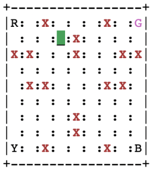
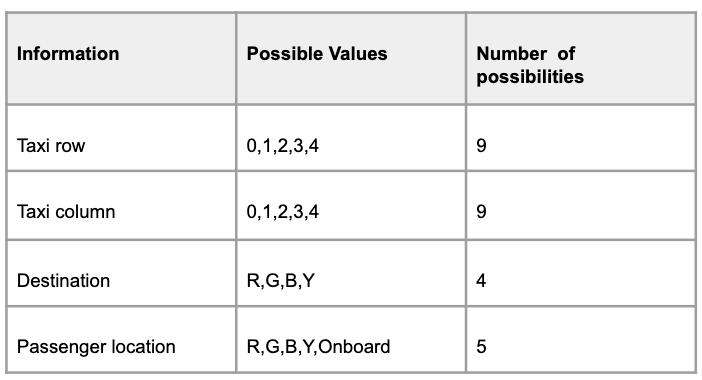
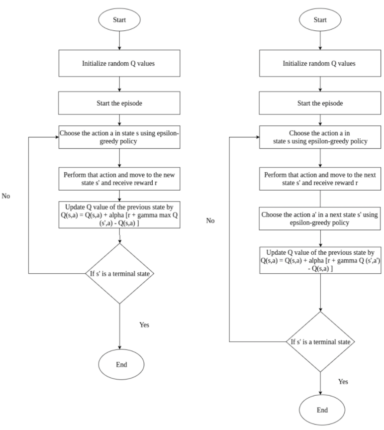
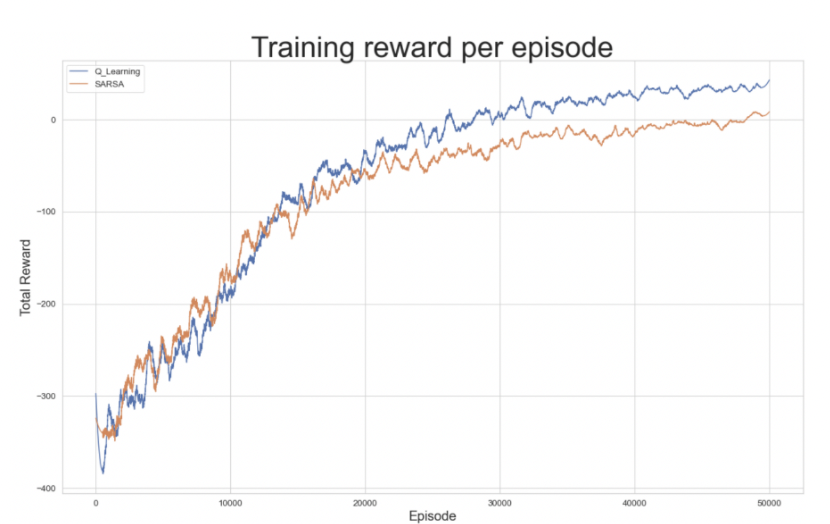

# Taxi Driving Agent (Modified from Open AI Gym v3)
## Introduction
### Original Problem from Open AI gym Taxi-v3
The source for the original problem is obtained from Open AI gym. which simulates a simplified taxi environment, the goal is to teach a taxi agent to be to pick up and drop off passenger to their destination with the least possible number of moves and while avoiding roadblocks(walls).
The simplified environment is broken into a 5x5 Grid and contains roadblocks(walls). The taxi is the only vehicle in this environment. There are 4 possible locations where passengers can be picked up or dropped off, these are labelled as R(ed), G(reen), Y(ellow), B(lue). The agent's task is to pick up a passenger from one of these locations and drop the passenger at another location

### Modified Problem
We modify the Open AI environment and make it bigger with a 9x9 gird & add plenty more walls. Also, we add one more constraint that the taxi can not hit the walls. If it does hit the wall, if it does hit the wall it's game over and the taxi gets a massive penalty.
The modified environment is shown below

## Problem Formulation

### Agent
The Taxi, which picks up passenger from the source and drops off passengers to their destination.

### Environment
The environment consists of
- Road
- Barrier/Walls
- Passenger Location
- Source Location
- Destination Location

### Agent’s goals
- Go to the source location & pick up the passenger 
- Go to destination & drop off the passenger.
- Save passenger's time by taking a minimum number of steps possible.
- Carefully handle passenger's safety, avoid bumping into barriers/walls

### Rewards
In Reinforcement Learning, the agent is motivated by the rewards. The Agent learns by trial and error and will try to maximize the rewards. Therefore, we need to decide the rewards and penalties and accordingly. We take the following points into consideration.
- For a correct pickup/drop-off, the agent should receive a high positive reward because this behaviour is highly desired. 
For Incorrect pickup/drop-off, the agent should get a large penalty since this is highly undesirable.
For every delayed timestep to reach the destination, the agent must get a slight penalty. This is acceptable because it is better to reach late rather than reach the wrong destination.
For hitting the wall there should be a massive penalty and should be the end of the episode.

We consider the rewards to be deterministic & define the following rewards
- Default Reward = -1
- Drop off at right location = +1000
- Pickup/Drop off at wrong location = -1000
- Hit the wall = -1000

### State Space 
The agent encounters a state & takes action based on its current state. The State Space is the set of all possible scenarios our taxi agent could encounter. The state contains useful information which is required by the agent to take optimal action. In this case, we have:

 Size of the state space = 9 * 9* 4* 5 = 1620

### Action Space
- Up
- Down 
- Left
- Right
- Pickup
- Drop-off

Based on the current state, the taxi may not be able to perform certain actions due to the presence of Barriers/walls. If the agent hit a wall the agent will be massively penalized & it will mark the end of the episode. In this way, the agent will learn to go around the wall.

## Solution
This problem is solved using Q learning and SARSA

## Result

